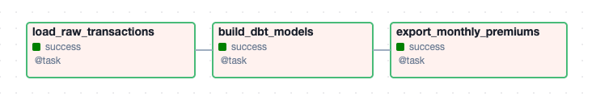

# Analytics Batch Pipeline Reference


[](https://github.com/olivierbenard/analytics-batch-pipeline-reference/actions/workflows/ci.yml)

# Why this project exists

This project is a reference implementation of a batch-oriented analytics pipeline designed to reflect how data transformations evolve from simple scripts to structured data platform workflows.

In many organizations, business-critical reporting logic initially lives in ad-hoc scripts that are difficult to validate, test, and scale. Over time, this logic needs to be formalized into a maintainable and reproducible data platform.

This repository was built to illustrate that transition in a controlled and explicit way.

It demonstrates how to:

- start from a minimal, deterministic Python implementation to validate business logic early
- progressively introduce structure through layered data modelling (raw -> staging -> marts)
- integrate SQL-based transformations using dbt for maintainability and lineage
- orchestrate the workflow using Airflow to reflect production scheduling patterns
- ensure reproducibility through containerized execution

The goal is not to showcase complexity, but to make architectural decisions, trade-offs, and evolution paths explicit.

# What this demonstrates

This project focuses on the engineering principles required to build reliable and maintainable data pipelines, rather than on the specific business use case.

## Separation of concerns

- Clear distinction between ingestion, validation, transformation, and output layers
- Layered data modelling (`raw -> staging -> marts`) aligned with modern analytics practices
- Isolation of business logic from infrastructure concerns

## Evolution from script to data platform

- A lightweight Python pipeline used as a baseline to validate assumptions and edge cases
- A platform-oriented implementation using PostgreSQL, dbt, and Airflow
- Demonstration of how the same logic can be expressed across different execution environments

## Deterministic and reproducible transformations

- Consistent aggregation logic across both execution paths
- Explicit handling of duplicate records through deterministic hashing
- Reproducible outputs independent of execution context

## Data quality and validation

- Validation and normalization of raw input records
- dbt tests enforcing assumptions on the transformed data (uniqueness, validity, consistency)
- Cross-validation between Python and SQL outputs to detect discrepancies

## Idempotency and robustness

- Safe re-execution of the pipeline without duplicating results
- Defensive handling of imperfect input data
- Explicit trade-offs between strict validation and pipeline resilience

## Production-oriented design

- Containerized environment for reproducibility
- Orchestration through Airflow to model real-world batch scheduling
- SQL-based transformations designed to be portable to cloud warehouses (e.g. Snowflake, BigQuery)

## Analytical modelling

- Implementation of finance-oriented aggregations (monthly premiums per partner and currency)
- Clear mapping between raw transactional data and business-facing metrics
- Support for downstream reporting and reconciliation use cases

# Workflow

This repository implements a production-ready premium aggregation pipeline that computes charged premiums totals per `partner`, `month` and `currency` from raw transaction data.

It is designed to support finance-oriented reporting use cases while remaining easy to **run locally**, **test**, and **extend**.

To structure the work, I deliberately followed a **two-step approach**.

* First, I implemented a **lightweight Python reference pipeline** to validate the transformation logic and produce a reliable baseline output.
* Second, I extended the project with a **data platform implementation (Postgres + dbt + Airflow)** to mirror how the same logic would run in a modern analytics stack.

The goal is to show both:
* the core transformation logic in isolation
* and how the same logic integrates into a **production-grade data platform**

# Overview

Independent of the approach, the pipeline computes:
```sql
monthly_premium_totals
GROUP BY partner, month, currency
FROM raw transaction data
WHERE status = processed
```

The repository is structured to illustrate how data processing can evolve from:
* simple script, to
* containerized batch, to
* orchestrated data pipeline running on a modern data platform

## Prerequisites

Before starting, make sure the following is installed:

- Docker Desktop
- GNU Make
- Python (for generating the Airflow Fernet key later on)

You can verify the installation with:

``` bash
docker --version
docker compose version
make --version
```

## Project Structure

The repository is organized to reflect the two implementation paths and the supporting platform components.

```text
.
├── Makefile
├── README.md
├── airflow/
│   ├── Dockerfile
│   ├── dags/
│   │   └── premium_transactions_pipeline.py
│   ├── init_airflow.sh
│   └── requirements.txt
├── analysis/
│   ├── 2024_monthly_premium_per_partner_eur.pdf
│   ├── 2024_monthly_premium_per_partner_eur_gbp.pdf
│   ├── 2024_monthly_premium_per_partner_gbp.pdf
│   ├── 2024_monthly_premium_per_partner_pivot_tables_and_charts.pdf
│   ├── notes.md             # result
│   └── output_reference.csv # result
├── dbt/
│   ├── Dockerfile
│   ├── analytics/
│   │   ├── dbt_project.yml
│   │   ├── macros/
│   │   ├── models/
│   │   │   ├── raw/
│   │   │   ├── staging/
│   │   │   └── marts/
│   │   ├── packages.yml
│   │   └── tests/
│   ├── profiles.yml
│   └── requirements.txt
├── docker-compose.yml
├── batch_pipeline_reference/
├── input/
├── makefiles/
├── output/
├── postgres/
│   ├── Dockerfile
│   └── init/
├── pyproject.toml
└── tests/
```

### Main folders

- `batch_pipeline_reference/`: **Reference Python implementation of the batch job**. It contains the end-to-end logic for reading the JSON input, validating and normalizing records, transforming them into the target aggregation, and writing the CSV output. This is the simplest execution path and serves as the baseline implementation.

- `postgres/`: PostgreSQL container definition and initialisation SQL scripts. This layer prepares the warehouse-style schemas (`raw`, `staging`, `marts`) and creates the raw ingestion table used by the platform-oriented execution path.

- `dbt/analytics/`: dbt project implementing the transformation layer. It contains:
  - `raw/` source declarations
  - `staging/` models for parsing and normalization
  - `marts/` models for business-facing aggregations
  - generic and singular tests
  - governance metadata, ownership, and lineage information

- `airflow/`: Airflow setup used to orchestrate the platform pipeline. The DAG `premium_transactions_pipeline.py` is responsible for:
  1. ingesting raw JSON records into PostgreSQL
  2. calling `dbt deps`
  3. running `dbt build`
  4. exporting the final mart output

- `tests/`: Pytest-based test suite for the Python reference pipeline. It covers the reader, validator, transformations, writer, CLI entrypoint, and an end-to-end test of the standalone batch execution.

- `analysis/`: Validation artifacts used to inspect the results from a business point of view. **This folder includes the `notes.md` file, reference output CSV, notes, and visual checks (pivot tables and charts)** produced while validating the aggregation logic.

- `input/`: Source dataset for the reference implementation.

- `output/`: Generated output files produced by the Python pipeline and by the orchestrated platform pipeline.

- `makefiles/` and `Makefile`: Convenience commands for local development and reproducible execution. These commands wrap service startup, Python execution, dbt commands, and checks so the reviewer can reproduce the workflow with minimal friction.

- `docker-compose.yml`: Local orchestration entrypoint for the services used in the platform-oriented setup.

- `pyproject.toml`: Python project configuration managed with Poetry, including dependencies, linting, typing, and test configuration.

### How to read the repository

A reviewer can approach the repository in the following order:

1. **Start with `batch_pipeline_reference/`** to understand the business logic in its simplest form.
2. **Look at `analysis/`** to see the assumptions, sanity checks, `notes.md` and reference `output.csv`.
3. **Move to `postgres/`, `dbt/analytics/`, and `airflow/`** to see how the same logic is translated into a platform-style implementation.
4. **Use the `Makefile` commands** to reproduce the execution paths locally.

This structure is intentionally designed to make it easy to distinguish between:

- the **reference implementation of the transformation logic**
- and the **production-style orchestration and modelling stack** built around it.

# Two Execution Paths

The repository supports two ways of running the pipeline.

## 1. Reference Python Batch Job (Baseline and Recommended Starting Point)

The project first implements a **simple Python batch job** to validate the transformation logic.

Purpose:

- validate assumptions about the dataset
- explore edge cases
- implement deterministic transformation logic
- generate a baseline output

The Python job:

1. Reads JSON transaction data from `input/`
2. Validates and normalises the records (here, in a single pass)
3. Aggregates monthly premiums
4. Writes the result to `output/output.csv`

The pipeline:

- reads raw transaction data from `input/`
- validates and transforms the records
- aggregates monthly premiums per partner and currency
- writes the resulting CSV file to `output/`

### Run the Python pipeline

```bash
cp .env.template .env # one-timer
make run-python-batch # to run the pipeline
```

The generated output can be found in:

```
output/output.csv
```

Additional analysis and visual representations of the results are available in:

```
analysis/
```

* This includes pivot tables and charts used to validate that the aggregation behaves as expected.
* This pipeline is intentionally minimal and focuses only on the **business logic**.

## 2. Data Platform Implementation (Postgres + dbt + Airflow)

After validating the transformation logic with the reference pipeline in Python, the same workflow is mapped onto a **data platform stack closer to a production analytics setup**.

The repository therefore includes Docker services for:

| Service  | Role                   |
|----------|------------------------|
| Postgres | Analytical database    |
| dbt      | SQL transformations    |
| Airflow  | Pipeline orchestration |

This setup demonstrates how the same logic can evolve from a **"simple" batch script** to a **structured data platform pipeline**.

The pipeline is executed through an **Airflow DAG**.

### Pipeline Steps

1. **Ingestion**
   - Airflow reads the JSON dataset
   - Data is loaded into PostgreSQL `raw` schema
   - **The original JSON payload is preserved**
   - A deterministic `payload_hash` is stored for idempotency
   - A `run_id` field is added to each record to track ingestion batches, enabling targeted reprocessing, lineage tracing, and debugging
   - No primary key is enforced at this stage. The raw layer is intentionally designed as a permissive ingestion boundary to avoid pipeline failures caused by upstream data quality issues and to retain a complete audit log of ingested events

   **On deduplication strategy**

   Although no PK is enforced, a uniqueness constraint is applied on `payload_hash` to prevent duplicate raw records during ingestion.

   This is a pragmatic choice for this implementation, ensuring:
   - idempotent ingestion at the storage layer
   - consistency between repeated pipeline runs

   An alternative design would be to keep the raw table strictly append-only (no constraints) and defer deduplication to downstream layers (e.g. using `MERGE` operations on a business key such as `transaction_id`).

   Both approaches are valid:
   - **constraint-based deduplication** simplifies ingestion and reduces downstream volume
   - **append-only ingestion** maximizes auditability and shifts responsibility to transformation layers

   The choice depends on the desired balance between ingestion strictness, audit guarantees, and operational complexity.

   For an alternative implementation of this ingestion boundary (where the raw layer is strictly append-only and deduplication is deferred to downstream transformations), see the CDC reference project:  
   * [`cdc-data-platform-reference`](https://github.com/olivierbenard/cdc-data-platform-reference).

   That approach prioritizes full auditability and late-binding transformations, and illustrates a different trade-off between ingestion permissiveness and downstream complexity.

1. **Transformation**
   - dbt models transform the raw dataset
   - staging model parses and validates fields
   - mart model computes aggregated premiums

2. **Validation**
   - dbt tests verify data quality:
     - unique transaction identifiers
     - valid currency values
     - valid timestamp formats
     - reconciliation tests between staging and mart

3. **Export**
   - The final aggregated dataset can be exported to CSV.

Visual overview of the Airflow Pipeline from the UI:


This mirrors a typical analytics warehouse pattern: raw -> staging -> mart.

### Why Preserve the Raw JSON Envelope

The ingestion layer intentionally stores the **full JSON payload** instead of immediately parsing every field.

Reasons:

- preserves the **original source record**
- enables **reprocessing if parsing logic changes**
- simplifies schema evolution
- allows deterministic deduplication using `payload_hash`

This pattern is common in event ingestion pipelines.

## Design philosophy

The overall implementation follows a few guiding principles:

- **start simple, validate early** with a minimal reference implementation
- **separate ingestion, validation, and transformation**
- **avoid premature platform complexity**
- **ensure reproducibility through containerization**

This approach allows the core transformation logic to remain **transparent and testable**, while still demonstrating how it can integrate into a more complete data platform.

# Project Initialisation (Data Platform Execution Path)

## 1. Configure Environment

This project uses environment variables that are read by Docker Compose and the initialisation scripts.

### Copying from the `.env.template`

Create your local environment file from the template:

``` bash
cp .env.template .env
```

Then edit the `.env` file and fill in the required values.

### Generate the Airflow Fernet key

Airflow requires a Fernet key to encrypt sensitive metadata stored in its database.

Generate a key with:

``` bash
make fernet_key
```

Paste the generated value into the `docker-compose.yml`:

```yaml
AIRFLOW_FERNET_KEY=...
```

## 2. Start the Platform Stack

Run the following command:

``` bash
make init
```

This command:

- starts the 3 Docker services:
  - `postgres`
  - `airflow`
  - `dbt`
- initialises PostgreSQL schemas
- initialises Airflow metadata
- creates the Airflow admin user

### Why Airflow initialisation runs separately

For simplicity, Airflow is executed as a **single container service** rather than being decomposed into multiple services (webserver, scheduler, worker, etc.).

Because of this simplified setup, the Airflow metadata initialisation and default admin user creation are executed via a **dedicated initialisation script after the containers start**.

This avoids **race conditions** during container startup while keeping the setup easy to reproduce locally.

To retrigger airflow initialisation:
```bash
make airflow-init
```

### PostgreSQL initialisation

PostgreSQL is initialised using SQL scripts located in:

   postgres/init/*.sql

These scripts are automatically executed **only when the database volume is empty** (first startup).

They create:

- warehouse schemas (`raw`, `staging`, `marts`)
- the raw ingestion table
- database roles and permissions

If the Postgres volume already exists, these scripts will **not run again automatically**.

If you want to force the run:
```bash
make clean # this purges the volumes
make init
```

## 5. Verify the environment

You can run a quick health check to ensure the services have been correctly initialised:

``` bash
make ps
make check-init
make logs
```

This command verifies that:

- `PostgreSQL` is reachable
- the expected schemas and tables exist
- `Airflow` is running with a dedicated user and database (to store variables and connections)
- `dbt` is available

## 6. Access the services

| Service    | URL / Connection      | Notes                                                                   |
|------------|-----------------------|------------------------------------------------------------------------ |
| Airflow UI | http://localhost:8080 | Login with the admin credentials defined in `.env`                      |
| PostgreSQL | localhost:5432        | Can be accessed with DBeaver or any SQL client                          |
| dbt        | CLI inside container  | Run with `docker exec analytics-batch-pipeline-reference-dbt-1 dbt run` |
| dbt docs   | http://localhost:8081 | Run with `dbt-docs`                                                     |

**Note:** the aforementioned ports must be available.

## Notes

- The setup is intentionally simplified for local development.
- Airflow runs in standalone mode rather than a distributed production topology.
- PostgreSQL initialisation scripts only run on the first database startup.

# Running the Airflow Pipeline

Open Airflow UI:
* [http://localhost:8080](http://localhost:8080)

Login using credentials from `.env`.

Trigger the DAG:

      premium_transactions_pipeline

The DAG performs:

1. Raw data ingestion into PostgreSQL
2. dbt dependency installation (`dbt deps`)
3. dbt model execution (`dbt build`)
4. dbt tests execution
5. export of the monthly premium into local `output/output_from_af.csv` file

## Inspecting the Data

You can connect to PostgreSQL using **DBeaver** or any SQL client.

Connection:

```
host: localhost
port: 5432
database: analytics -- depending on your .env
```

Schemas created:
```
raw
staging
marts
```

Example queries:
```sql
-- check the table has been initialised
select * from raw.premium_transactions_raw where 1 = 0;

-- check the schemas have been initialised
select
   schema_name
from information_schema.schemata
order by schema_name;

-- * run the Airflow pipeline *

-- check that the data landed (2660 records, duplicates and 'process' not yet removed)
select count(*) from raw.premium_transactions_raw;

-- staging table
select * from staging.stg_premium_transactions limit 10;

-- marts tables
select * from marts.monthly_partner_premiums;
select * from marts.monthly_currency_totals; -- extra table that aggregates total_premium per month and currency
```

## Deduplication discovery

While comparing the results produced by the Python batch pipeline and the Airflow/Postgres pipeline, I noticed a discrepancy in the aggregated output.

Example:
```text
dronant,2024-07-01,EUR,1754.42     (Python)
dronant,2024-07-01,EUR,1749.48     (Airflow)
liadigital,2024-06-01,EUR,2197.32  (Python)
liadigital,2024-06-01,EUR,2193.12  (Airflow)
```

The difference was caused by duplicate raw records.

The Airflow ingestion step uses:

```sql
INSERT ... ON CONFLICT (payload_hash) DO NOTHING
```

which automatically deduplicates raw payloads at the database layer.

The Python reference pipeline initially lacked this step, causing duplicates to be counted in the aggregation.

To align both execution paths, I introduced **deterministic payload hashing** and raw-record deduplication in the Python implementation.

More details are available in `analysis/notes.md`.

## Viewing dbt Lineage and Documentation

dbt automatically generates a **data lineage graph** based on `source()` and `ref()` dependencies.

Generate documentation:

```bash
make dbt-docs-generate
```

Serve documentation:

```bash
make dbt-docs-serve
```

Open:
```
http://localhost:8081
```

The docs show:

- dataset lineage
- column documentation
- test results
- model ownership metadata

# Development

The Python development environment uses **Poetry** with a `pyproject.toml` configuration.

Install dependencies:

```bash
poetry install
```

Run checks (`ruff`, `mypy`, `pylint`, `tests`, `branch coverage`):

```bash
make checks
```

To run the python batch pipeline locally:
```bash
make run
```

# Makefile Shortcuts

Common commands:

| Command                  | Purpose                            |
|--------------------------|------------------------------------|
| `make run-python-batch`  | run the standalone Python pipeline |
| `make init`              | start platform services            |
| `make clean`             | reset containers and volumes       |
| `make dbt-build`         | run dbt models + tests             |
| `make dbt-docs-generate` | generate dbt documentation         |
| `make dbt-docs-serve`    | serve lineage UI                   |

# Architecture Choices and Trade-offs

This project intentionally mirrors the architectural patterns commonly used in modern analytics platforms, while keeping the local execution environment **lightweight** and **reproducible**.

The solution uses the following components:

- **PostgreSQL** as a local analytical database
- **dbt** for SQL-based transformations and data modeling
- **Apache Airflow** for orchestration of the batch workflow
- **Docker Compose** for reproducible local execution

The goal is to reflect a production-style architecture while keeping the implementation **simple enough to run locally**.

## Why This Stack

The chosen stack reflects a typical modern data platform architecture:

| Layer               | Tool           | Role                                     |
|---------------------|----------------|------------------------------------------|
| Storage / Warehouse | PostgreSQL     | Stores raw and transformed data          |
| Transformation      | dbt            | Builds data models and business logic    |
| Orchestration       | Airflow        | Schedules and coordinates pipeline steps |
| Runtime             | Docker Compose | Ensures reproducible local environment   |

Although the original system may use a cloud warehouse such as Snowflake, PostgreSQL provides a lightweight alternative that enables local development while preserving the same conceptual architecture.

## Why PostgreSQL for Database

PostgresSQL is trivial to reproduce locally. Using PostgreSQL provides:

- a lightweight local analytical database
- SQL support suitable for aggregation workloads
- compatibility with dbt
- reproducible execution without cloud dependencies

The transformation **logic is written in SQL and dbt models, which would translate directly to Snowflake/BigQuery or any other system in a production environment**.

## Why dbt for Transformations

dbt was chosen because it provides:

- clear separation between **raw ingestion** and **analytics-ready models**
- version-controlled SQL transformations
- dependency management between datasets
- a standard workflow for analytics engineering

In this project, dbt is used to model the transformation pipeline:
```
raw transactions -> staging model -> aggregated monthly premiums
```

This mirrors the common layered warehouse pattern:
```
raw -> staging -> mart
```

## Why Airflow for Orchestration

Airflow is used to orchestrate the pipeline steps:

1. Load raw JSON data into PostgreSQL
2. Execute dbt transformations
3. Export the aggregated results to a CSV file

Although the pipeline could be executed as a simple script, introducing an orchestrator reflects how such workloads are typically scheduled in production.

For the purpose of this exercise:

- Airflow is run as a **single container service**
- both scheduling and task execution occur in the same container

This simplifies the setup while still demonstrating orchestration concepts.

## Why Not Fully Reproduce Production Infrastructure

A full production data platform would typically include:

- separate Airflow services (scheduler, webserver, workers)
- a dedicated metadata database
- cloud warehouse infrastructure
- object storage layers
- CI/CD deployment pipelines

**Reproducing that environment locally would introduce unnecessary complexity for the scope of this reference implementation.**

Instead, the implementation focuses on:

- clear pipeline structure
- reproducibility
- maintainability
- explicit documentation of assumptions and trade-offs

## Possible Production Enhancements

In a production environment, the following improvements would likely be added:

- Snowflake/BigQuery/Redshift as the primary analytical warehouse
- distributed Airflow deployment
- Airflow logging + tests and linting
- Parallel audit pipelines
- Eventually a shift from Airflow to Dagster (the data asset concept is appealing)
- automated data quality checks
- data lineage and observability
- incremental data ingestion
- CI/CD pipeline for dbt models
- etc.

### Note on Parallel Audit Pipelines

A potential enhancement would be to introduce a parallel data flow dedicated to populating audit and observability tables alongside the main transformation pipeline.

Instead of treating audit as a by-product, this approach models it as a first-class concern of the data platform.

This parallel flow would capture:

- ingestion metrics (records processed, duplicates detected, rejected records)
- data quality signals (validation failures, schema inconsistencies)
- transformation lineage (row counts between layers, reconciliation checks)
- execution metadata (run duration, task status, retries)

By decoupling audit collection from the core transformation logic, the pipeline gains:

- improved observability without polluting business transformations
- easier debugging and root cause analysis
- the ability to build monitoring dashboards and alerting on top of audit tables
- a foundation for SLAs and data reliability metrics

In a production setting, this pattern can evolve into a dedicated observability layer, feeding monitoring systems or data quality frameworks. This effectively introduces a dual-pipeline model:
- a **data pipeline** producing business datasets
- an **audit pipeline** producing operational and reliability signals

This pattern aligns with modern data platform practices where observability is treated as a separate concern rather than embedded into transformation logic.
